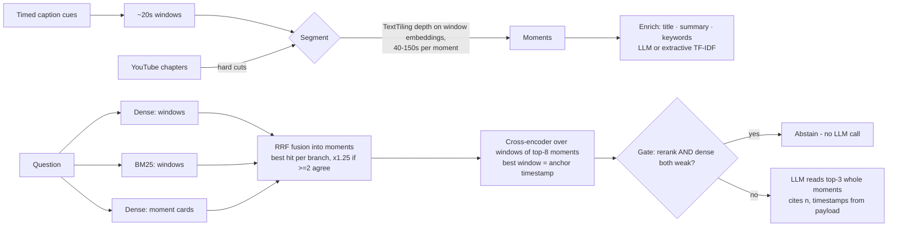

# Implement Semantic Search to Moment Search

A baseline semantic-search RAG and a **Moment RAG** built over the same YouTube transcript,
evaluated side by side on 36 hand-labeled questions.

**Video:** Patrick Winston, [*How to Speak*](https://www.youtube.com/watch?v=Unzc731iCUY)
(MIT OpenCourseWare, 63:42, 11 chapters, 8.7k words of human-written captions).
It's an hour of distinct, nameable ideas (how to start, time and place, boards, props,
slides, job talks, how to stop), each with concrete, checkable answers (11 AM, seven
seconds, "one-shot learning") that need no specialist knowledge to grade. One chapter runs
23 minutes, which is a real test of splitting a long section by topic. It is also deliberately
not the reference repo's sample video (3Blue1Brown's 8-minute *LLMs explained briefly*): at
8 minutes there are too few chunks for chunk boundaries to matter much.

## What Moment Search does (codebase review)

The reference codebase ([traversaal-ai/momentsearch](https://github.com/traversaal-ai/momentsearch))
indexes videos as **moments**: points on a video's timeline that an answer can cite and jump to.

| Moment Search (video) | This project (transcript only) |
|---|---|
| Captions → ~20s timed transcript chunks (`ingest/transcript.py`) | Captions → ~20s timed **windows** (`moments.build_windows`) |
| Two retrieval branches, always both: CLIP frames + transcript text | Three branches, always all: dense windows, BM25 windows, enriched moment cards |
| `_fuse`: RRF per branch, hits within `FUSION_WINDOW_S` collapse into one moment, best hit per branch, ×boost when branches agree | Same, but the join key is the **moment boundary** (topic segment) instead of a fixed ±15s window |
| Cross-encoder rerank of text-bearing moments | Cross-encoder over every window of the top moments; best window = the **anchor** (jump-to time) |
| Confidence gate: abstain, no LLM call, only when *neither* branch clears its bar | Abstain only when the reranker *and* dense similarity are both weak; the dense threshold is re-fit per video on held-out calibration questions |
| `CONTEXT_PAD_S`: the LLM also reads speech around each moment | The LLM reads the whole moment; an edge anchor pulls in the neighbouring window |
| Citations validated; timestamps come from the payload, never the LLM | Same (`answer.validate_citations`, `render_sources`) |

Not carried over: the visual (CLIP frame) branch, Prefect queue, Qdrant/Postgres, diarization.
This is an in-process study of the *retrieval idea* on transcripts.

## The two systems

**Part 1 — Baseline** (`src/momentrag/baseline.py`): flatten transcript → 200-word chunks
with 40-word overlap → `bge-small-en-v1.5` embeddings → FAISS (cosine) → top-3 chunks →
LLM answer. No timestamps reach the user.

**Part 2 — Moment RAG** (`src/momentrag/moments.py`, `moment_rag.py`):



Both systems share the embedder, the LLM, and the answer rules; only structure and retrieval differ.

## Results

36 hand-labeled questions ([eval/questions.json](eval/questions.json)): 16 fact lookups,
10 explanations, 4 "where in the video" questions, and 6 the talk doesn't answer. Each has
gold time spans, answer-keyword regexes and a reference answer. The headline system is the
full design, with LLM-written moment cards (`run_eval.py --enrich-llm`); the keyless
extractive-card fallback is reported separately below because it behaves differently.

**Retrieval** ([results/llm-cards/retrieval_summary.md](results/llm-cards/retrieval_summary.md))

| System | Evidence found | Span MRR | Jump lands on answer | Median jump error | Context words | Refused unanswerable |
|---|---|---|---|---|---|---|
| Baseline, top-3 chunks | 83.3% | 0.850 | 56.7% | 30.1 s | 600 | 0/6 |
| Baseline, top-5 chunks | 90.0% | 0.858 | 56.7% | 30.1 s | 996 | 0/6 |
| **Moment RAG, top-3 moments** | **93.3%** | **0.883** | **73.3%** | **7.9 s** | **635** | **3/6** |

*Evidence found*: every answer keyword appears in the retrieved context. *Jump lands*: the
rank-1 pointer (the moment's anchor; for the baseline, its chunk's first-word time, which it
never shows) is within 20s before the gold span. The gate wrongly refused 1/30 answerable
questions ("what share of the audience is fogged out?").

**Answers** (blind LLM judge vs reference answers, [eval/judge.py](eval/judge.py), gpt-5.6-luna)

| Moment cards | System | Fact (16) | Explain (10) | Where (4) | Unanswerable declined (6) | Answerable correct |
|---|---|---|---|---|---|---|
| LLM-written | Baseline | 13 | 8 | 0 | 6 | 21/30 |
| LLM-written | **Moment RAG** | **15** | 7 | **2** | 6 | **24/30** |
| Extractive | Baseline | 14 | 9 | 0 | 6 | 23/30 |
| Extractive | Moment RAG | 14 | 7 | 1 | 6 | 22/30 |

The baseline's retrieval is identical in both runs, yet its score moved from 23 to 21: LLM
run-to-run variance is about ±2 questions, so the answer-level gap is suggestive, not proven.
An earlier run of the same pipeline on a second video (Karpathy's *Intro to LLMs*, commit
`74e0162`) gave 26/30 vs 22/30 in Moment RAG's favour.

**Ablations** (Moment RAG with LLM cards, adding one component at a time)

| Configuration | Evidence | Span MRR | Jump lands | Latency (warm) |
|---|---|---|---|---|
| Moments, dense windows only | 90.0% | 0.844 | 70.0% | 6 ms |
| + BM25 | 93.3% | 0.900 | 76.7% | 6 ms |
| + moment cards (LLM) | 93.3% | 0.933 | 83.3% | 6 ms |
| + cross-encoder rerank / anchor | 93.3% | 0.883 | 73.3% | 37 ms |
| + confidence gate (full) | 93.3% | 0.883 | 73.3% | 39 ms |

With *extractive* cards the card branch hurts instead (evidence 93.3% → 83.3%, MRR 0.900 →
0.817): 17 moments share the chapter title "The Tools: Boards, Props, and Slides", so their
cards are near-duplicates and the branch boosts the wrong moment in that chapter.

| Segmentation | Moments | Median length | Evidence | Jump lands | Context words |
|---|---|---|---|---|---|
| Fixed 120 s | 29 | 130 s | 96.7% | 76.7% | 929 |
| Chapters only | 11 | 219 s | 96.7% | 73.3% | 4,245 |
| Semantic only | 47 | 73 s | 93.3% | 73.3% | 657 |
| Chapters + semantic (default) | 49 | 72 s | 93.3% | 73.3% | 635 |

**Findings**

1. **Fixed chunks fail by dilution, not by missing text.** The chunk holding the
   knowledge × practice × talent formula (00:19–01:46) also holds the opening anecdote and the
   Mary Lou Retton story; it ranks 9th of 55, so the baseline says it "couldn't find the formula".
2. **Moments win on retrieval at an equal word budget:** 93.3% vs 83.3% evidence with 635 vs
   600 words, and the jump point lands a median 8s from the answer instead of 30s.
3. **Enrichment is not optional.** LLM-written cards are what make the card branch help; the
   keyless extractive fallback made retrieval and answers worse on this video.
4. **Short moments split long lists.** "Winston's star" (five elements over three minutes) and
   the three survey findings on inspiration span two or three moments, so Moment RAG returns
   only part of the list. Longer blocks (fixed 120s, chapters) find more, at 1.5–6.7× the context.
5. **The LLM doesn't always use the anchor.** For "where" questions it sometimes quotes a
   moment's start instead of the anchor time it was given; the rendered jump links are right,
   the prose is not.
6. **The reranker's value is the gate, not the ranking.** It lowered MRR and jump accuracy
   here too, but it gives the calibrated score that lets 3/6 off-topic questions stop with no LLM call.

**Limitations:** one video in this run; 36 questions labeled by one person (one question =
3.3 points); judge and generator are the same model family; LLM variance of about ±2 questions;
the dense gate threshold is fit on 14 calibration questions per video and the two groups were
only 0.014 apart here; boundaries snap to 20s windows; no visual branch.

**Improvements:** read the neighbouring moment when the anchor is near an edge or the moment
ends mid-list; make the answer cite the anchor time directly; punctuation-aware boundaries;
Moment Search's CLIP frame branch for the slides he shows; split multi-part questions; a
multi-video eval with several labelers and an independent judge.

## Run it

```bash
python3.12 -m venv .venv && .venv/bin/pip install -r requirements.txt
cp .env.example .env                 # optional: OPENAI_API_KEY for generated answers

.venv/bin/python ask.py --moments    # the video's moments
.venv/bin/python ask.py "Why does he advise against opening a talk with a joke?"
.venv/bin/python eval/run_eval.py                       # retrieval metrics + ablations (keyless)
.venv/bin/python eval/run_eval.py --enrich-llm --answers  # LLM moment cards + answers
.venv/bin/python -m pytest -q        # offline tests
```

`ask.py` reuses the LLM-written moment cards cached by `run_eval.py --enrich-llm` and
falls back to extractive cards; it never calls an LLM just to build cards. Retrieval runs fully locally (no API key). Answers use OpenAI when `OPENAI_API_KEY` is set,
else a local Ollama server, else retrieval-only (`src/momentrag/llm.py`). Transcripts,
chapters, and moments are cached in `data/` after the first run (the caption text is
git-ignored and re-fetched from YouTube), so reruns are offline.

## Layout

```
ask.py                    side-by-side CLI demo (both systems, same question)
src/momentrag/
  transcript.py           captions -> timed cues (rolling-caption overlap removed), chapters
  models.py               shared local models: bge-small embedder, MiniLM cross-encoder
  baseline.py             Part 1: fixed word chunks + FAISS
  moments.py              Part 2: windows, segmentation, enrichment
  moment_rag.py           Part 2: 3-branch retrieval, RRF fusion, rerank/anchor, gate
  answer.py               prompts, citation validation, source rendering
  llm.py                  OpenAI / Ollama / none
eval/questions.json       36 labeled questions (gold spans + answer-keyword regexes)
eval/calibration.json     held-out questions used only to set the abstention gate
eval/run_eval.py          metrics, ablations, answer scoring
results/                  metric tables, per-question traces, generated answers
```
