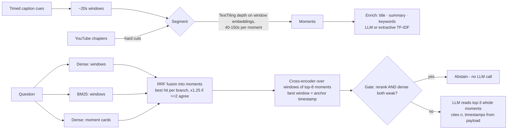

# From Semantic Search to Moment Search

A baseline semantic-search RAG and a **Moment RAG** built over the same YouTube transcript,
evaluated side by side on 36 hand-labeled questions.

**Video:** Andrej Karpathy, [*[1hr Talk] Intro to Large Language Models*](https://www.youtube.com/watch?v=zjkBMFhNj_g)
(59:48, 21 chapters, ~12k words of auto-generated captions).
It's dense and fact-heavy (numbers, names, worked demos), it runs a full hour so chunking
decisions matter, its topics shift roughly every 1–3 minutes, and its captions are
auto-generated (no punctuation, misheard words), which is the realistic, messy case.

## What Moment Search does (codebase review)

The reference codebase ([traversaal-ai/momentsearch](https://github.com/traversaal-ai/momentsearch))
indexes videos as **moments**: points on a video's timeline that an answer can cite and jump to.

| Moment Search (video) | This project (transcript only) |
|---|---|
| Captions → ~20s timed transcript chunks (`ingest/transcript.py`) | Captions → ~20s timed **windows** (`moments.build_windows`) |
| Two retrieval branches, always both: CLIP frames + transcript text | Three branches, always all: dense windows, BM25 windows, enriched moment cards |
| `_fuse`: RRF per branch, hits within `FUSION_WINDOW_S` collapse into one moment, best hit per branch, ×boost when branches agree | Same, but the join key is the **moment boundary** (topic segment) instead of a fixed ±15s window |
| Cross-encoder rerank of text-bearing moments | Cross-encoder over every window of the top moments; best window = the **anchor** (jump-to time) |
| Confidence gate: abstain, no LLM call, only when *neither* branch clears its bar | Abstain only when the reranker *and* dense similarity are both weak (thresholds from a held-out calibration set) |
| `CONTEXT_PAD_S`: the LLM also reads speech around each moment | The LLM reads the whole moment; an edge anchor pulls in the neighbouring window |
| Citations validated; timestamps come from the payload, never the LLM | Same (`answer.validate_citations`, `render_sources`) |

Not carried over: the visual (CLIP frame) branch, Prefect queue, Qdrant/Postgres, diarization.
This is a single-video, in-process study of the *retrieval idea*.

## The two systems

**Part 1 — Baseline** (`src/momentrag/baseline.py`): flatten transcript → 200-word chunks
with 40-word overlap → `bge-small-en-v1.5` embeddings → FAISS (cosine) → top-3 chunks →
LLM answer. No timestamps reach the user.

**Part 2 — Moment RAG** (`src/momentrag/moments.py`, `moment_rag.py`):



Both systems share the embedder, the LLM, and the answer rules; only structure and retrieval differ.

## Results

36 hand-labeled questions ([eval/questions.json](eval/questions.json)): 16 fact lookups,
10 explanations, 4 "where in the video" questions, and 6 the video can't answer. Each has
gold time spans, answer-keyword regexes and a reference answer. Moment RAG here uses the
default keyless configuration (chapters + semantic segmentation, extractive cards).

**Retrieval** ([results/extractive-cards/retrieval_summary.md](results/extractive-cards/retrieval_summary.md))

| System | Evidence found | Span MRR | Jump lands on answer | Median jump error | Context words | Refused unanswerable |
|---|---|---|---|---|---|---|
| Baseline, top-3 chunks | 80.0% | 0.794 | 46.7% | 36.6 s | 598 | 0/6 |
| Baseline, top-5 chunks | 93.3% | 0.809 | 46.7% | 36.6 s | 998 | 0/6 |
| **Moment RAG, top-3 moments** | **90.0%** | **0.811** | **63.3%** | **16.7 s** | **979** | **3/6** |

*Evidence found*: every answer keyword appears in the retrieved context. *Jump lands*: the
rank-1 pointer (the moment's anchor; for the baseline, its chunk's first-word time, which it
never shows) is within 20s before the gold span. The gate wrongly refused 2/30 answerable questions.

**Answers** (blind LLM judge vs reference answers, [eval/judge.py](eval/judge.py), gpt-5.6-luna)

| | Fact (16) | Explain (10) | Where (4) | Unanswerable declined (6) | Answerable correct |
|---|---|---|---|---|---|
| Baseline | 13 | 9 | 0 | 6 | 22/30 (73.3%) |
| **Moment RAG** | 13 | 10 | **3** | 6 | **26/30 (86.7%)** |

A second run with LLM-written moment cards gave 21/30 vs 24/30.

**Ablations** (Moment RAG, adding one component at a time)

| Configuration | Evidence | Span MRR | Jump lands | Latency (warm) |
|---|---|---|---|---|
| Moments, dense windows only | 83.3% | 0.856 | 70.0% | 6 ms |
| + BM25 | 90.0% | 0.911 | 70.0% | 6 ms |
| + moment cards | 96.7% | 0.894 | 70.0% | 6 ms |
| + cross-encoder rerank / anchor | 96.7% | 0.861 | 66.7% | 43 ms |
| + confidence gate (full) | 90.0% | 0.811 | 63.3% | 49 ms |

| Segmentation | Moments | Median length | Evidence | Context words |
|---|---|---|---|---|
| Fixed 120 s | 28 | 133 s | 93.3% | 1,301 |
| Chapters only | 21 | 172 s | 93.3% | 2,164 |
| Semantic only | 43 | 76 s | 93.3% | 945 |
| Chapters + semantic (default) | 40 | 86 s | 90.0% | 979 |

**Findings**

1. **Fixed chunks fail by dilution, not by missing text.** The chunks holding "140 GB" and
   "$70M / $283M" were indexed but ranked 4th and 5th, because 200 words averaged two topics.
2. **The clearest win is navigation.** Median jump error drops from 37s to 17s, and
   "where in the video" answers go from 0/4 to 3/4. Timestamps come from the retrieval payload.
3. **At an equal word budget, recall is a tie** (93.3% vs 90.0%). Moments don't find more text;
   they deliver it as a coherent, located unit.
4. **BM25 and moment cards carry the recall gain.** The reranker's main value is a calibrated
   score for the gate. LLM-written cards did no better than extractive ones, and segmentation
   choice mostly changed context cost (chapters alone send 2.2× the words).
5. **The gate is a trade.** It refuses 3/6 unanswerable questions with no LLM call, but also
   2/30 answerable ones. One of those is an ASR error ("reversal course"), which defeats the reranker.

**Limitations:** one video; 36 questions labeled by one person (one question = 3.3 points);
judge and generator are the same model family; run-to-run LLM variance of about ±1 question;
gate thresholds set on only 14 calibration questions ([eval/calibration.json](eval/calibration.json));
boundaries snap to 20s windows; no visual branch.

**Improvements:** punctuation restoration so cuts land on sentence ends; feed the cards'
corrected spellings into BM25 and the reranker; add Moment Search's CLIP frame branch; split
multi-part questions; a multi-video eval with several labelers and an independent judge;
hierarchical chapter → moment → window search.

## Run it

```bash
python3.12 -m venv .venv && .venv/bin/pip install -r requirements.txt
cp .env.example .env                 # optional: OPENAI_API_KEY for generated answers

.venv/bin/python ask.py --moments    # the video's moments
.venv/bin/python ask.py "What valuations did ChatGPT impute for Scale AI's Series A and B?"
.venv/bin/python eval/run_eval.py                       # retrieval metrics + ablations (keyless)
.venv/bin/python eval/run_eval.py --enrich-llm --answers  # LLM moment cards + answers
.venv/bin/python -m pytest -q        # offline tests
```

Retrieval runs fully locally (no API key). Answers use OpenAI when `OPENAI_API_KEY` is set,
else a local Ollama server, else retrieval-only (`src/momentrag/llm.py`). Transcripts,
chapters, and moments are cached in `data/` after the first run (the caption text is
git-ignored and re-fetched from YouTube), so reruns are offline.

## Layout

```
ask.py                    side-by-side CLI demo (both systems, same question)
src/momentrag/
  transcript.py           captions -> timed cues (rolling-caption overlap removed), chapters
  models.py               shared local models: bge-small embedder, MiniLM cross-encoder
  baseline.py             Part 1: fixed word chunks + FAISS
  moments.py              Part 2: windows, segmentation, enrichment
  moment_rag.py           Part 2: 3-branch retrieval, RRF fusion, rerank/anchor, gate
  answer.py               prompts, citation validation, source rendering
  llm.py                  OpenAI / Ollama / none
eval/questions.json       36 labeled questions (gold spans + answer-keyword regexes)
eval/calibration.json     held-out questions used only to set the abstention gate
eval/run_eval.py          metrics, ablations, answer scoring
results/                  metric tables, per-question traces, generated answers
```
